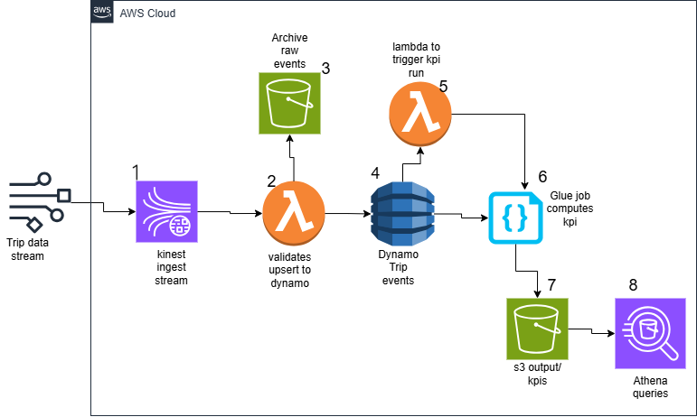

#  Real-Time Event-Driven Data Pipeline for Ride-Hailing Trip Events

---

## Project Overview & Business Problem

###  Overview

This project is a real-time, serverless, event-driven data pipeline that simulates how a ride-hailing platform processes streaming trip events. It is built entirely using AWS services and designed to be highly scalable, fault-tolerant, and production-ready.

The system ingests `trip_start` and `trip_end` events using AWS Kinesis, validates and processes these records through AWS Lambda, and stores the clean, merged output into DynamoDB. It then computes and stores daily KPIs in Amazon S3 using either AWS Lambda or AWS Glue, providing flexible analytics support.

###  Project Scope



This project covers the following end-to-end objectives:

* Real-time ingestion and processing of trip events
* Strict data validation and schema enforcement
* Raw and rejected data archiving for traceability
* Event merging logic to handle out-of-order and delayed events
* Real-time status tracking (e.g., in\_progress, complete)
* Staleness detection for incomplete trips
* Automated KPI generation and S3 reporting
* CI/CD deployment of all Lambda functions using GitHub Actions

###  Business Problem

Ride-hailing companies need real-time visibility into their operations to:

* Monitor trips that are currently in-progress
* Generate revenue reports per day
* Track trends like average fare, trip distance, and tip frequency
* Detect stale or failed trips (e.g., no drop-off)
* Avoid double-counting due to duplicate or malformed data

This project solves these problems through a scalable AWS architecture, providing clean data storage, automated KPI computation, and end-to-end event traceability.

---

##  Business Logic, Data Format & Validation

###  Business Logic Flow

1. Receive trip event JSON from simulated `trip_start.csv` and `trip_end.csv`
2. Stream each JSON event into Kinesis
3. AWS Lambda (processor) consumes events from Kinesis:

   * Validates schema
   * Stores raw & invalid data to S3
   * Merges start/end events into a single record using `trip_id`
   * Updates status (e.g. `in_progress`, `complete`)
   * Flags stale records based on timestamps
4. Merged and clean records are saved in DynamoDB
5. A second Lambda (or Glue Job) scans DynamoDB daily and computes KPIs
6. KPI output is stored in S3 for visualization with Athena/QuickSight

---

###  Data Format & Simulation

The data is simulated using two CSV files:

* `trip_start.csv`
* `trip_end.csv`

These are converted to JSON and injected into Kinesis as real-time streaming events.

#### trip\_start.json Example:

```json
{
  "event_type": "trip_start",
  "trip_id": "abc123",
  "data": {
    "pickup_location_id": 41,
    "dropoff_location_id": 74,
    "vendor_id": 2,
    "pickup_datetime": "2024-05-25 09:19:00",
    "estimated_dropoff_datetime": "2024-05-25 09:57:00",
    "estimated_fare_amount": 10.5
  }
}
```

#### trip\_end.json Example:

```json
{
  "event_type": "trip_end",
  "trip_id": "abc123",
  "data": {
    "dropoff_datetime": "2024-05-25 10:00:00",
    "rate_code": 1,
    "passenger_count": 1,
    "trip_distance": 1.13,
    "fare_amount": 12.08,
    "tip_amount": 0,
    "payment_type": 1,
    "trip_type": 1
  }
}
```

---

###  Data Validation Logic

Every incoming event is validated with strict rules:

* Required fields must be present
* Field types must match expected schema (e.g., no string in `fare_amount`)
* Invalid or malformed events are archived in S3 (`rejected/` folder)
* Valid but raw events are stored in `raw/` folder for auditing
* Schema is enforced manually using Python + checks in Lambda

This validation ensures only trusted data reaches DynamoDB and KPIs.

---


---

###  AWS Architecture Overview

```
    trip_start.csv       trip_end.csv
          │                   │
          └── Simulated JSON Events via Script
                             │
                      ┌──────▼──────┐
                      │  Kinesis    │
                      │ Data Stream │
                      └──────┬──────┘
                             │
                     ┌───────▼────────┐
                     │ Lambda Function│
                     │ (Processor)    │
                     └───────┬────────┘
                             │
     ┌───────────────────────▼────────────────────────┐
     │                   DynamoDB                     │
     │           Table: TripEvents (PK: trip_id)      │
     └───────────────────────┬────────────────────────┘
                             │
            ┌────────────────────────────────┐
            │   Lambda or AWS Glue Job       │
            │    (Daily KPI Aggregation)     │
            └────────────────┬───────────────┘
                             │
               ┌─────────────▼─────────────┐
               │     Amazon S3 Buckets     │
               │     (Complete & InProg)   │
               └─────────────┬─────────────┘
                             │
                  ┌──────────▼─────────────┐
                  │ Athena / QuickSight     │
                  └────────────────────────┘
```

---

###  Lambda Event Processor

* Listens to events from the Kinesis Stream
* Validates schema and data types
* Each event is archived in:

  * `s3://lab6kinesis/raw/YYYY-MM-DD/`
  * Invalid → `s3://lab6kinesis/rejected/YYYY-MM-DD/`

####  Idempotency Logic

* Uses `trip_id` as unique key
* For every new event (start or end), the Lambda:

  * Checks if the record already exists in DynamoDB
  * If field (e.g. `start_event`) is already filled → skip update
  * If field is new → perform upsert (merge logic)

>  Prevents duplicates and allows reprocessing without errors

---

###  DynamoDB Upsert and Stale Logic

* Table: `TripEvents`
* Partition Key: `trip_id`
* Fields stored per record:

  * `trip_id`
  * `start_event` (JSON)
  * `end_event` (JSON)
  * `status`: `in_progress` or `complete`
  * `is_stale`: True/False
  * `start_event_arrived_at`
  * `end_event_arrived_at`

>  "In-progress" trips are those with only one side of the event
> 🕐 "Stale" trips are those stuck too long (e.g. >3 hrs)

---

##  KPI Computation and Storage

KPIs are calculated daily using either Lambda or Glue. Output includes:

###  Computed Metrics

* `trip_date`
* `total_trips`
* `total_fare`
* `average_fare`
* `min_fare`
* `max_fare`
* `stale_trip_count`
* `in_progress_trip_count`

###  Stored in Amazon S3

* Completed Trips:

  * `s3://lab6kinesis/kpis/complete/2024-05-25.json`
* In-Progress Trips:

  * `s3://lab6kinesis/kpis/in_progress/2024-05-25.json`

> These files are ready for querying using Athena and visualizing with QuickSight

---

##  KPI Triggering Methods

###  Option 1: Lambda Trigger

* A separate Lambda function calls `start_job_run()` via boto3
* This Lambda is scheduled every 6 hours using CloudWatch rule

###  Option 2: EventBridge Scheduler

* Directly triggers Glue job using cron: `cron(0 6 * * ? *)`
* Recommended for large-scale automation without Lambda


## 

###  Local Project Setup

1. **Folder Structure**

```
project-root/
├── lambda/
│   ├── processor_handler.py
│   ├── kpi_handler.py
├── queues/
│   ├── trip_start_queue.json
│   ├── trip_end_queue.json
├── dynamodb_mock/
│   └── db.json
├── output/
│   └── kpis/
├── simulator/
│   └── simulate_stream.py
├── upload/
│   └── upload_kpis_to_s3.py
├── .github/
│   └── workflows/deploy_lambda.yml
```

2. **Install Requirements**

```bash
pip install boto3 pandas
```

3. **Run Simulation Locally**

```bash
python simulator/simulate_stream.py
```

4. **Process Events Locally (optional)**

```bash
python lambda/processor_handler.py
```

5. **Compute KPIs Locally**

```bash
python lambda/kpi_handler.py
```

6. **Upload KPIs to S3**

```bash
python upload/upload_kpis_to_s3.py
```

---

###  AWS Deployment Guide

1. **Create AWS Resources**

   * S3 Bucket: `lab6kinesis`
   * DynamoDB Table: `TripEvents` (PK = `trip_id`)
   * Kinesis Stream: `trip_events_stream`
   * 2 Lambda functions:

     * `handle_trip_events_lambda`
     * `generate_kpis_lambda`

2. **Attach IAM Policies**

   * Grant Lambda permissions to:

     * Read/write DynamoDB
     * Write to S3
     * Read from Kinesis
     * Start Glue jobs (optional)

3. **CI/CD with GitHub Actions**

   * Push to `lab7` branch triggers deployment:

```yaml
on:
  push:
    branches: [lab7]
```

* Each Lambda is zipped and uploaded automatically

4. **Secrets Setup**

   * In GitHub repo settings:

     * `AWS_ACCESS_KEY_ID`
     * `AWS_SECRET_ACCESS_KEY`
     * `AWS_REGION` (e.g. `eu-north-1`)

5. **Create CloudWatch Rule (Optional)**

   * Use cron expression `cron(0 0,6,12,18 * * ? *)`
   * Target Lambda to trigger Glue every 6 hours

---

###  Testing the Entire Pipeline

* Simulate 10–100 streaming events
* Check Kinesis delivery into Lambda logs (via CloudWatch)
* Validate entries in DynamoDB:

  * Check for `status: complete` or `in_progress`
  * Confirm `is_stale` flags
* Check raw and rejected folders in S3
* Trigger KPI Lambda manually
* Check S3 KPI files exist in correct folder structure
* Use Athena to query `kpis/complete/` for report analysis

---

##  Key Strengths and Features

*  Real-time data ingestion and processing
*  Fault-tolerant with schema validation and idempotency
*  Accurate upsert logic avoids overwrites or duplicates
*  Separate stale/in-progress tracking for data health
*  Valid raw data and rejected data archived in S3
*  Daily automation via Lambda or Glue
*  CI/CD for seamless deployment from GitHub

---


---


